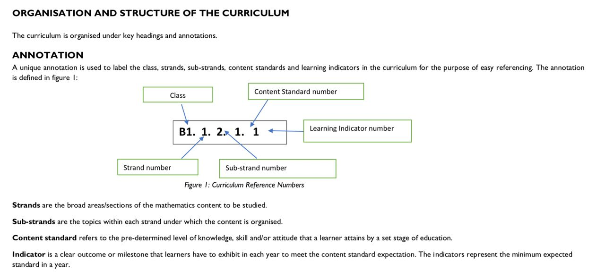

Source documents
================

Overview
--------
To learn about the Ghana curriculum framework, consult 
[National-Pre-tertiary-Education-Curriculum-Framework-final.pdf](./National-Pre-tertiary-Education-Curriculum-Framework-final.pdf).

PDF docs
--------
The PDF documents in this directory were downloaded from 
[https://nacca.gov.gh/?page_id=9230](https://nacca.gov.gh/?page_id=9230) and 
are © National Council for Curriculum and Assessment (NaCCA), Ministry of Education Ghana.

List of standards documents for each subject:

  - [KG-Curriculum.pdf](./KG-Curriculum.pdf)
  - [MATHS-LOWER-PRIMARY-B1-B3.pdf](./MATHS-LOWER-PRIMARY-B1-B3.pdf)
  - [MATHS-UPPER-PRIMARY-B4-B6.pdf](./MATHS-UPPER-PRIMARY-B4-B6.pdf)
  - [GHANAIAN-LANGUAGE-B1-B3.pdf](./GHANAIAN-LANGUAGE-B1-B3.pdf)
  - [GHANAIAN-LANGUAGE-B4-B6.pdf](./GHANAIAN-LANGUAGE-B4-B6.pdf)
  - [ENGLISH-LOWER-PRIMARY-B1-B3.pdf](./ENGLISH-LOWER-PRIMARY-B1-B3.pdf)
  - [ENGLISH-B4-B6.pdf](./ENGLISH-B4-B6.pdf)
  - [CREATIVE-ARTS-B1-B3.pdf](./CREATIVE-ARTS-B1-B3.pdf)
  - [CREATIVE-ARTS-B4-B6-.pdf](./CREATIVE-ARTS-B4-B6-.pdf)
  - [FRENCH-B4-B6.pdf](./FRENCH-B4-B6.pdf)
  - [COMPUTING-B4-B6.pdf](./COMPUTING-B4-B6.pdf)
  - [HISTORY-B1-B6.pdf](./HISTORY-B1-B6.pdf)
  - [OUR-WORLD-AND-OUR-PEOPLE-B1-B3-1.pdf](./OUR-WORLD-AND-OUR-PEOPLE-B1-B3-1.pdf)
  - [OUR-WORLD-AND-OUR-PEOPLE-B4-B6-1.pdf](./OUR-WORLD-AND-OUR-PEOPLE-B4-B6-1.pdf)
  - [PHYSICAL-EDUCATION-B1-B6.pdf](./PHYSICAL-EDUCATION-B1-B6.pdf)
  - [RELIGIOUS-AND-MORAL-EDUCATION-B1-B6.pdf](./RELIGIOUS-AND-MORAL-EDUCATION-B1-B6.pdf)
  - [SCIENCE-LOWER-PRIMARY-B1-B3.pdf](./SCIENCE-LOWER-PRIMARY-B1-B3.pdf)
  - [SCIENCE-UPPER-PRIMARY-B4-B6.pdf](./SCIENCE-UPPER-PRIMARY-B4-B6.pdf)
  - [TEACHER-RESOURCE-PACK-P1-P6.pdf](./TEACHER-RESOURCE-PACK-P1-P6.pdf)

Statement structure
-------------------
The structure of each statement is described below:

See [this example](https://groccad.github.io/research/literature_review.html#example-ghana).
